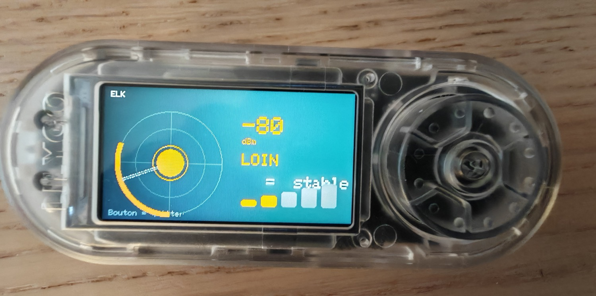
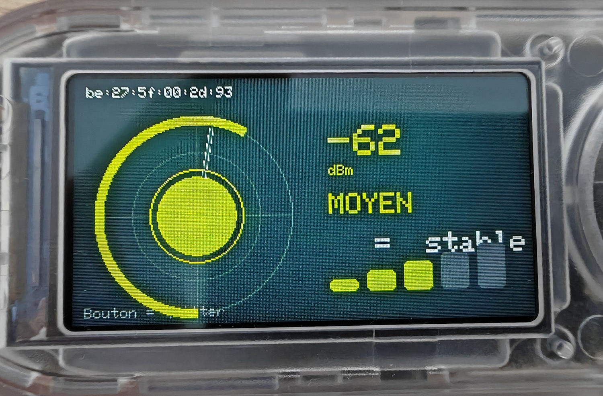
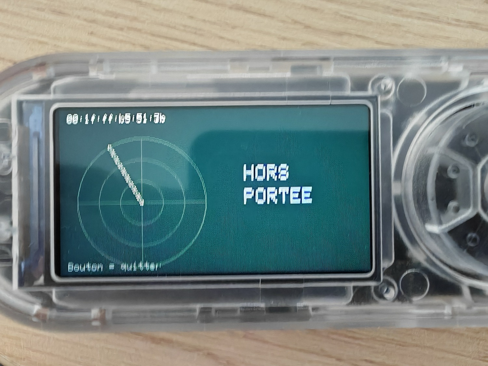
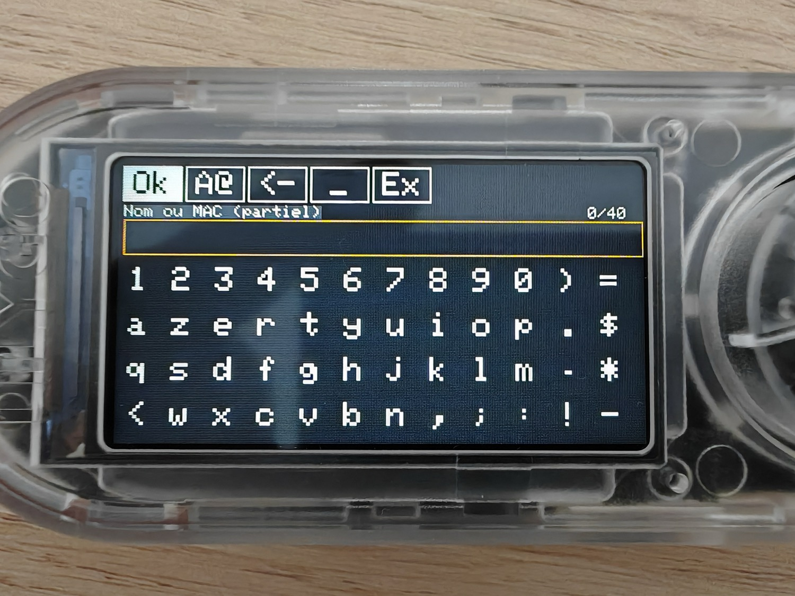

# 📡 BLE Finder — traqueur de proximité Bluetooth pour Bruce

  

> **EN** — A BLE proximity radar written in JavaScript for the **[Bruce firmware](https://github.com/BruceDevices/firmware)** (LilyGO T-Embed CC1101). Pick a Bluetooth device and the screen guides you like a metal detector: the blip grows and turns red→green as you get closer, with a **HOTTER / COLDER** hint at each step.

Script **JavaScript** pour le firmware **[Bruce](https://github.com/BruceDevices/firmware)** (testé sur **LilyGO T-Embed CC1101**). Il transforme l'appareil en **radar de proximité BLE** : choisis un périphérique Bluetooth, puis l'écran te guide comme un détecteur — **plus tu t'approches, plus le blip grossit et passe du rouge au vert**, avec un indicateur **« PLUS CHAUD / PLUS FROID »** à chaque pas.

## ✨ Fonctionnalités

- **Deux modes de sélection** :
  - **Liste complète** — scanne et affiche tous les appareils BLE (nom + RSSI).
  - **Recherche (nom / MAC)** — tape un **bout** de nom ou d'adresse MAC → filtre la liste → tu choisis. S'il n'est pas encore là, option **« attendre qu'il apparaisse »**.
- **Radar sonar** : anneau-jauge qui se remplit, **blip central** dont la taille et la couleur (rouge → jaune → vert) reflètent la proximité, balayage animé.
- **dBm en direct**, zone (`TRÈS PROCHE` … `TRÈS LOIN`), flèche **chaud/froid** et **barres de signal**.
- Reste en **« recherche… »** tant que la cible n'est pas captée (utile si elle est hors de portée puis réapparaît).

## 🖼️ Aperçu

| Radar (proche) | Recherche / hors de portée | Saisie du filtre |
|---|---|---|
|  |  |  |

## 🚀 Installation

1. Copie **`BLE Finder.js`** sur la carte SD, dans un dossier que Bruce lit : **`/BruceJS`**, `/scripts` ou `/BruceScripts`.
2. Sur l'appareil : **JS Interpreter** → ouvre `BLE Finder.js`.
3. Choisis un mode, sélectionne ta cible, et promène-toi : le blip chauffe quand tu approches.
4. **Bouton retour / ESC** pour quitter.

## ⚙️ Réglages (en tête du script)

- `SCAN_SEC` — durée d'un scan de suivi (défaut 1 s).
- `LO` / `HI` — plage RSSI (loin → proche, défaut −100 → −35 dBm). Ajuste selon les dBm réels que tu observes.

## 📝 Notes techniques

- Le retour est **100 % à l'écran** : sur Bruce 1.15, l'audio (`audio.tone`) et la LED RGB **ne sont pas pilotables en temps réel depuis un script JS** — le radar visuel est la solution fiable.
- Les appareils utilisant une **MAC aléatoire** (AirPods, trackers récents) peuvent « sauter » en suivi par adresse ; le suivi par **nom** est alors plus stable.
- La cible doit **émettre** (advertising) pour être détectée.

## 🖥️ Compatibilité

Conçu pour **LilyGO T-Embed CC1101** (écran 320×170) sous **Bruce**. Devrait fonctionner sur d'autres cibles Bruce avec un écran couleur.

## ☕ Un café ?

Si ce script te plaît :

## 📄 Licence

MIT — voir [LICENSE](LICENSE). Par **koua29** (Arnaud).
